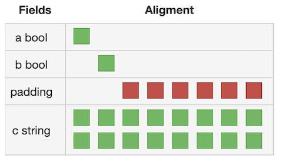

.center.icon[]
---

class: top white
background-image: url(img/sound.svg)
background-size: 130%
.top.icon[]

.sound-top[
  # Как меня слышно и видно?
]

.sound-bottom[
  ## > Напишите в чат
  ### **+** если все хорошо
  ### **-** если есть проблемы cо звуком или с видео
]

---

class: white
background-image: url(img/message.svg)
.top.icon[]

# Структуры в Go

### Алексей Бакин

---

# Небольшой тест

.left-text[
Пожалуйста, пройдите небольшой тест.
<br><br>
Возможно вы уже многое знаете про структуры в Go =)
<br><br>
Ссылка в чате.
]

.right-image[

]

---

# Структуры

```
struct{}  // пустая структура, не занимает памяти

type User struct { // структура с именованными полями
  Id      int64
  Name    string
  Age     int
  friends []int64  // приватный элемент
}
```

---

# Создание структур

```
var u0 User   // Zero Value для типа User

u1 := User{}  // Zero Value для типа User

u2 := &User{} // Указатель на структуру

u3 := User{1, "Vasya", 23, nil}

u4 := User{
  Id:       1,
  Name:     "Vasya",
  Age:      23,
  friends:  []int64{1, 2, 3},
}

```

---

# Анонимные типы и структуры

```
type testCases []struct{
  name     string
  input    string
  expected string
}
```

```
cases := testCases{
  {name: "test1", input: "StR", expected: "str"},
  {name: "empty"},
}
```

---

# Анонимные типы и структуры

```
type Resp struct {
  Ok        bool
  Documents []struct{
    Id    int
    Title string
  }
}
```

```
r := Resp{
  Ok: true,
  Documents: []struct {
    Id    int
    Title string
  }{{0, "zero"}, {1, "one"}},
}
```
---

# Размер и выравнивание структур

```
type x struct {
  a bool     // 1
  b bool     // 1
  c uint64   // 8
}
```


[http://golang-sizeof.tips/](http://golang-sizeof.tips/)

---

# Указатели

Указатель - это адрес некоторого значения в памяти.

Указатели строго типизированы.

Zero Value для указателя - nil.

```
x := 1         // Тип int
xPtr := &x     // Тип *int
var p *int     // Тип *int,  значение nil
```

---

# Получение адреса

```
type x struct {
  a int
  b string
  c [10]rune
}
bPtr := &x.b
c3Ptr := &x.c[2]
```

НО!
```
dict := map[string]string{"a": "b"}
valPtr := &dict["a"]  // не скомпилируется (почему?)
```

---

# Получение адреса 

```
	s := []int{1,2,3}
	p := &s[1]
	fmt.Println(*p, s) // 2, [1, 2, 3]

	*p = 10
	fmt.Println(*p, s) // ?
	
	s = append(s, 4)
	*p = 20
	fmt.Println(*p, s) // ?
```

---

# Разыменование указателей

```
a := "qwe"  // Тип string
aPtr := &a  // Тип *string
b := *aPtr  // Тип string, значение "qwe"

var n *int  // nil
nv := *n    // panic
```

```
s := struct{x, y int }{1, 3} // структура
p := &s                      // указатель
fmt.Println(s.x)      // ? (1)
fmt.Println((*p).x)   // ? (2)
fmt.Println(p.x)      // ? (3)

p = nil
fmt.Printf("%T\n", p) // ? (4)
fmt.Println(p.x)      // ? (5)
```

---

# Копирование указателей и структур

```
a := struct{x, y int}{0, 0}
b := a
a.x = 1
fmt.Println(b.x) // ?
```

```
a := new(struct{x, y int})
b := a
a.x = 1
fmt.Println(b.x) // ?
```

```
a := struct{x *int}{new(int)}
b := a
*a.x = 1
fmt.Println(*b.x) // ?
```

---

# Определение методов

```
type User struct {
  Id      int64
  Name    string
  Age     int
  friends []int64
}

func (u User) IsFriendOf(other User) bool {
  for _, fid := range other.friends {
    if u.Id == fid {
      return true
    }
  }
  return false
}

func main() {
	u1 := User{}
	u2 := User{}
	fmt.Println(u1.IsFriendOf(u2))
}
```

---

# Методы типа и указателя на тип

```
type User struct {
  Age int
}

func (u User) callValue() {
  u.Age++
}

func (u *User) callPointer() {
  u.Age++
}

func main() {
  u := User{23}
  
  u.callValue()
  fmt.Println(u.Age) // ?
  
  u.callPointer()
  fmt.Println(u.Age) // ?
}
```

---

# Функции-конструкторы

```
var u0 User

u1 := User{}

u2 := &User{}

u3 := User{1, "Vasya", 23, nil}

u4 := User{
  Id:       1,
  Name:     "Vasya",
  Age:      23,
  friends:  []int64{1, 2, 3},
}

func NewUser() *User {
  ...
}

```

---

# Функции-конструкторы

Когда нужен конструктор?

```
type Waiter struct {
	ch chan struct{}
}

func NewWaiter() *Waiter {
	return &Waiter{
		ch: make(chan struct{}),
	}
}

func (w *Waiter) Wait() {
	<-w.ch
}

func (w *Waiter) NotifyAll() {
	close(w.ch)
}
```

---

# Zero-value

```
type User struct {
  Id      int64
  Name    string
  Age     int
  friends []int64
}

func (u *User) AddFriend(id int64) {
  u.friends = append(u.friends, id)
}
```

```
u := User{}
u.AddFriend(1)
```
---

# nil receiver

```
type RateLimiter struct {
  ...
}

func (r *RateLimiter) Allow() bool {
  if r == nil {
    return true
  }
  return r.allow()
}
```

---

# Задачка

.left-code[
Реализовать тип `IntStack`, который содержит стэк целых чисел.
У него должны быть методы `Push(i int)` и `Pop() int`.
<br><br>

Ссылка в чате.
]

.right-image[

]

---

# Встроенные структуры

```
type Address struct {
  City string
  Street string
}

type Organization struct {
  Address
  Name string
  Phone string
}
```

```
org := Organization{Address: Address{City: "Spb", Street: "Nevski"}}
fmt.Println(org.City)
fmt.Println(org.Address.City)
```

---

# Продвижение методов

```
type Address struct {
  City string
  Street string
}

func (a Address) String() string {
  return a.City + ", " + a.Street
}

type Organization struct {
  Address
  Name string
  Phone string
}
```

```
org := Organization{Address: Address{City: "Spb", Street: "Nevski"}}
fmt.Println(org.String())
fmt.Println(org.Address.String())
```

---

# Но, это не наследование

```
type Base struct {}
func (b Base) Name() string {
  return "Base"
}
func (b Base) Say() {
  fmt.Println(b.Name())
}

type Child struct {
  Base
}
func (c Chind) Name() string {
  return "Child"
}
```

```
c := Child{}
c.Say() // Base
```
---

# Тэги элементов структуры

Тэг - это метафинформация в формате:
```
`key:"value" key1:"value1,value11"`
```
Например
```
type User struct {
  Id      int64    `json:"-"`
  Name    string   `json:"name"`
  Age     int      `json:"user_age" db:"how_old:`
  friends []int64
}
```

Получить информацию о тэгах можно через `reflect`
```
u := User{}
ut := reflect.TypeOf(u)
ageField := ut.FieldByName("Age")
jsonSettings := ageField.Get("json")  // "user_age"
```

---

# Использование тэгов для JSON сериализации

```
// Задать имя поля в JSON документе
Field int `json:"dleif"`

// Не выводить в JSON поля у которых Zero Value
Author *User `json:"author,omitempty"`

// Использовать имя поля Author, но не выводить Zero Value
Author *User `json:",omitempty"`

// Игнорировать это поле при сериализации / десереализации
Field int `json:"-"`
```

---

# Использование тэгов для работы с СУБД

`github.com/jmoiron/sqlx`
```
type User struct {
    Name string `db:"name"`
    Age  string `db:"age"`
}
var user User
row := db.QueryRow("SELECT * FROM users WHERE id=?", 10)
err = row.Scan(&user)
```

`github.com/jinzhu/gorm`
```
type User struct {
  gorm.Model
  Email        string  `gorm:"type:varchar(100);unique_index"`
  Role         string  `gorm:"size:255"` // set field size to 255
  MemberNumber *string `gorm:"unique;not null"` // set member number to unique and not null
  Num          int     `gorm:"AUTO_INCREMENT"` // set num to auto incrementable
  Address      string  `gorm:"index:addr"` // create index with name `addr` for address
  IgnoreMe     int     `gorm:"-"` // ignore this field
}
```
---

# Небольшой тест

.left-text[
Давайте проверим, что вы узнали за этот урок, а над чем стоит еще поработать.
<br><br>
Ссылка в чате.
]

.right-image[

]

---

# Опрос

.left-text[
Заполните пожалуйста опрос
<br><br>
Ссылка в чате.
]

.right-image[

]

---

# Домашнее задание

Реализовать двусвязный список.

```
List:     // тип контейнер
  Len()   // длинна списка
  First() // первый Item
  Last()  // последний Item
  PushFront(v interface{}) // добавить значение в начало
  PushBack(v interface{})  // добавить значение в конец
  Remove(i Item)           // удалить элемент
​
Item:                  // элемент списка
  Value() interface{}  // возвращает значение
  Nex() *Item          // следующий Item
  Prev() *Item         // предыдущий
```

---

class: white
background-image: url(img/message.svg)
.top.icon[]

# Спасибо за внимание!
