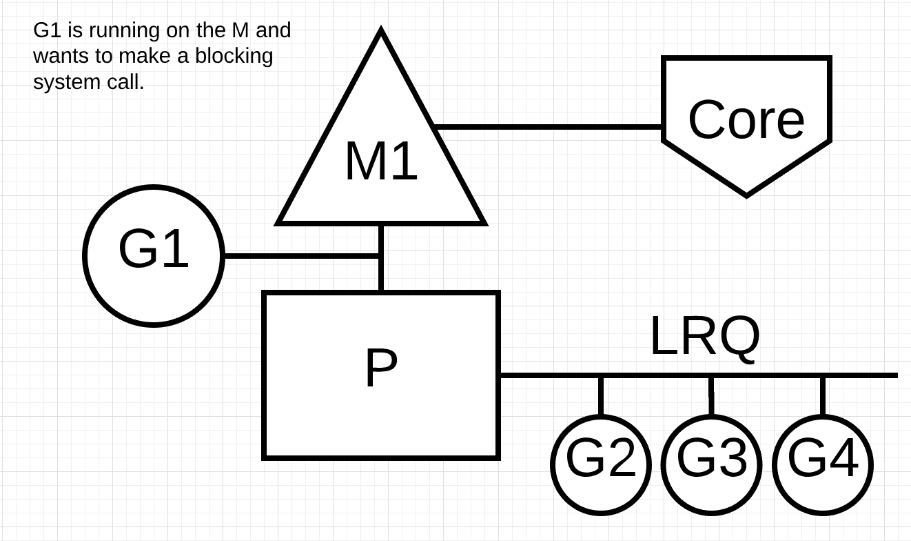
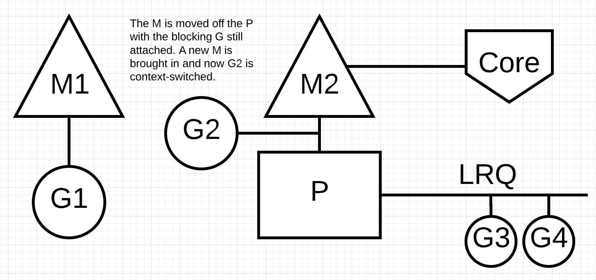

.center.icon[]

---


class: white
background-image: url(img/message.svg)
.top.icon[]

# Go-рутины и каналы

### Дмитрий Смаль

---

class: top white
background-image: url(img/sound.svg)
background-size: 130%
.top.icon[]

.sound-top[
  # Как меня слышно и видно?
]

.sound-bottom[
  ## > Напишите в чат
  ### **+** если все хорошо
  ### **-** если есть проблемы cо звуком или с видео
  ### !проверить запись!
]

---

# Небольшой тест

.left-text[
Пожалуйста, пройдите небольшой тест. 
<br><br>
Возможно вы уже многое знаете про Go-рутины и каналы в Go =)
<br><br>
[]()
]

.right-image[

]

---

# План занятия

.big-list[
* Горутины
* Каналы
* Буферизация каналов
* Примеры использования каналов
* О работе планировщика в Go
]

---

# Goroutine / Горутины

Горутины - обычные функции, которые выполняются конкурентно (в пересекающиеся моменты времени).
Горутины - легковесные, у каждой из них свой стек, все остальное (память, файлы и т.п.) - общее.
Запуск новой горутины производится с помощью ключевого слова `go`.

```
func main() {
  go func(arg string) {
    time.Sleep(10*time.Second)
    fmt.Println("hello", arg)
  }("world")  // передача аргументов в горутину
  
  fmt.Println("main")
  time.Sleep(10*time.Second)
  fmt.Println("main again")
}
```
Или
```
go list.Sort()
```

Горутина завершается когда происходит выход из функции или когда завершается основная программа (функция main).

---


# Каналы

Канал - тип (и механизм) в Go, предназначенный для синхронизации горутин и передачи данных между ними.
Канал работает по принципу FIFO.

```
var c chan string       // Канал для передачи строк

var c chan int          // Канал не инициализирован, nil

var c = make(chan int)  //  Канал инициализирован, емкость - 0

var c = make(chan int, 10)  // Емкость буфера 10 элементов
```

Каналы могу быть:
* на чтение / на запись / и то и другое
* буферизованными / небуферизованными
* открытыми / закрытыми

---

# Чтение и запись в канал

Запись в канал осуществляется оператором `<-` справа от канала, т.е. `ch <- value`
```
var ch = make(chan int, 10)

ch <- 42
```

Чтение из канала - также оператором `<-`, но слева от канала

```
var i int

i := <- ch      // получить данные из канала в переменную i

i, ok := <- ch  // получить данные и флаг открытости

<- ch           // получить и отбросить данные из канала
```

В один канал могут писать (и читать из него) несколько горутин.

---

# Пример работы канала

```
func primeChecker(in chan int, out chan int) {
  for {
    i := <- in
    if isPrime(i) {
      out <- i
    }
  }
}

func main() {
  var inCh = make(chan int, 10)
  var outCh = make(chan int, 10)

  go primeChecker(inCh, outCh)
  // go primeChecker(inCh, outCh)
  go func() {
    for {
      fmt.Println(<- outCh)
    }
  }()

  for i := 0; i < 1000000; i++ {
    inCh <- i
  }
}
```

---

# Итерация по каналу

Значения из канала удобно получать в цикле с помощью `range`. <br>

Функции с предыдущего слайда можно переписать как:

```
func primeChecker(in chan int, out chan int) {
  for i := range in {
    if isPrime(i) {
      out <- i
    }
  }
}

go func() {
  for j := range outCh {
    fmt.Println(j)
  }
}()
```

---

# Закрытие канала

Канал можно "закрыть" с помощью встроенной функции `close`.

После "закрытия" канала:
* чтение из него будет возвращать zero value для типа канала
* запись в него приведет к panic (!)
* итерация с помощью `range` прекратиться
* оператор `select` будет сразу всегда возвращать zero value

```
var in = make(chan int, 10)
go func() {
  for i := range in {
  }
}()
go func() {
  for {
    i, ok := <- in
    if !ok {
      return
    }
  }
}()
close(in)
```

Best practise: *Закрывать канал должна пишущая горутина, либо создатель!*

---

# Каналы на чтение и на запись

В Go есть возможность уточнить способ использования (чтение/запись) канала, указав это при объявлении типа.
Тип канал-на-чтение объявляется как `<-chan T`, канал-на-запись как `chan<- T`

```
func primeChecker(in <-chan int, out chan<- int) {
  // из in можно только читать
  // в out можно только писать
}

var inCh = make(chan int, 10)
var outCh = make(chan int, 10)

primeChecker(inCh, outCh) // автоматическое преобразование типов
```

Формально `chan T`, `<-chan T` и `chan<- T` - различные типы данных, однако при присвоении (с уточнением) работает автоматическое преобразование типа.

---

# Пустые и полные каналы

Что произойдет ?

```
var ch1 = make(chan int, 10)
i := <- ch1
```

А в таком случае ?

```
var ch2 = make(chan int, 10)
for i := 0; i < 20; i++ {
  ch2 <- i
}
```

---

# Буферизация каналов

Запись в канал возможна, если есть горутина, вызвавшая операцию чтения из канала, либо есть место в буфере.
И наоборот чтение возможно, если есть горутина, вызвавшая операцию записи, либо есть данные в буфере.
<br><br>

```
var notBuffered = make(chan int)  // буфера нет

var buffered = make(chan int, 10) // длинна буфера 10

buffered <- 1
buffered <- 2
buffered <- 3  // сработает, даже если никто не читает

// функции len и cap показывают размер и заполненость буфера
fmt.Println(len(buffered)) // 3
fmt.Println(cap(buffered)) // 10

```

Основное назначение *буферизованных* каналов - эффективный и *неблокирующий* обмен данными между горутинами

---

# Конструкция select

Конструкция `select` в Go позволяет одновременно читать(писать) из нескольких каналов.

```
var stop <-chan struct{}
var out1 chan<- interface{}
var out2 chan<- interface{}
// ^^ каналы должны быть инициализированы ^^

select {
  case out1 <- value1:
    fmt.Println("succeded to send to out1")
  case out2 <- value2:
    fmt.Println("succeded to send to out1")
  case <- stop:
    fmt.Printf("manually stopped")
}
```

`select` пытается записать(получить) данные в доступный канал, т.е. тот в котором есть место в буфере или ожидающая горутина. Если ни одна операция не возможна на данный момент, `select` блокирует выполнение текущей горутины.


---

# select default

В конструкцию `select` можно добавить секцию `default`, которая будет выполнена если ни один одна
из операций с каналами не может быть совершена в данный момент.

```

select {
  case out1 <- value1:
    fmt.Println("succeded to send to out1")
  case out2 <- value2:
    fmt.Println("succeded to send to out1")
  case <- stop:
    fmt.Printf("manually stopped")
  default:
    fmt.Printf("nothing happens")
    time.Sleep(10*time.Millisecond)
}
```
---

# Патерны: отправка сигналов

Закрытие канала - один из способов "послать сигнал" горутине.

```
var start = make(chan struct{}) // "барьер"

for i := 0; i < 10000; i++ {

  go func() {
    <- start
    // горутины не начнут работу
    // пока не будут созданы все 10000
  }()

}

close(start)
```

Часто закрытие канала используют как сигнал на выход из горутины или остановку чего-либо.

---

# Патерны: функция-генератор

Генератор - функция, возвращающая последовательность значений. В Go - это функция возвращающая канал.

```
func ReadDir(dir string) <-chan string {
  c := make(chan string, 5)
  go func() {
    f, err := os.Open(dir)
    if err != nil {
      close(c)
    }
    names, err := f.Readdirnames(-1)
    if err != nil {
      close(c)
    }
    for _, n := range names {
      c <- n
    }
  }()
  return c
}
```

---

# Патерны: таймауты и повторы

`time.Timer` - позволяет получить "уведомление" через указанное время

```
timer := time.NewTimer(10*time.Second)
select {
  case data <- in:
    fmt.Printf("received: %s", data)
  case <- timer.C:
    fmt.Printf("failed to receive in 10s")
}
```

`time.Ticker` - позволяет получать "периодические уведомления"

```
ticker := time.NewTicker(10*time.Second)
OUT:
for {
  select {
    case <- ticker.C:
      fmt.Println("do some job")
    case <- stop:
      break OUT
  }
}
```
---


# Патерны: мультиплексирование

В Go можно слить два однотипных канала в один

```
func Merge(in1, in2 <-chan interface{}) <-chan interface{} {
  ret := make(chan interface{})
  for {
    select {
    case v := <- in1:
      ret <- v
    case v := <- in2:
      ret <- v
    }
  }
  return ret
}
```

Полная версия [https://play.golang.org/p/JHVD4Sz9Px1](https://play.golang.org/p/JHVD4Sz9Px1)

---

# Работа планировщика Go

.full-image[

]

[https://www.ardanlabs.com/blog/2018/08/scheduling-in-go-part1.html](https://www.ardanlabs.com/blog/2018/08/scheduling-in-go-part1.html)
[https://www.ardanlabs.com/blog/2018/08/scheduling-in-go-part2.html](https://www.ardanlabs.com/blog/2018/08/scheduling-in-go-part2.html)

---

# Факты о планировщике


* В Go не-вытесняющий планировщик (пока, но скоро будет наоброт)
* Передача управления планировщику при:
  * Системном вызове
  * Создании новой горутины `go`
  * Работа с каналами / mutext и другой синхронизацией
  * Garbage Collection
  * Вызове `runtime.Gosched`
* Длинные циклы и вычисления не могут быть прерваны (пока), это может приводить к зависанию
* С помощью `runtime.GOMAXPROCS` можно доступное Go число ядер процессора.

---

# Асинхронные системные вызовы (1)

.full-image[

]

---

# Асинхронные системные вызовы (2)

.full-image[

]

---

# Асинхронные системные вызовы (3)

.full-image[

]

---

# Cинхронные системные вызовы (1)

.full-image[

]

---

# Cинхронные системные вызовы (2)

.full-image[

]

---

# Cинхронные системные вызовы (3)

.full-image[

]

---


# Небольшой тест

.left-text[
Проверим что мы узнали за этот урок
<br><br>
[]()
]

.right-image[

]

---

# Домашнее задание

---

# Опрос

.left-text[
Заполните пожалуйста опрос
<br><br>
[]()
]

.right-image[

]

---

class: white
background-image: url(img/message.svg)
.top.icon[]

# Спасибо за внимание!


---
