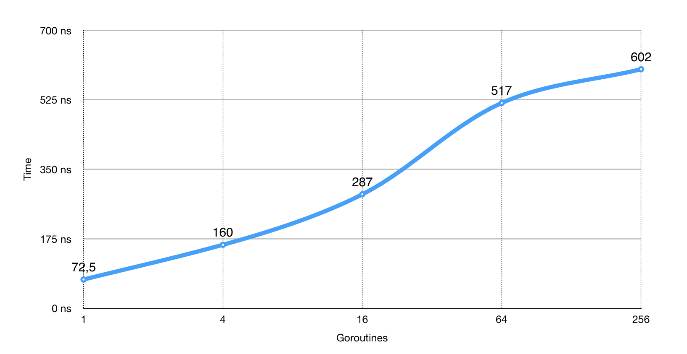

.center.icon[]

---

class: top white
background-image: url(img/sound.svg)
background-size: 130%
.top.icon[]

.sound-top[
  # Как меня слышно и видно?
]

.sound-bottom[
  ## > Напишите в чат
  ### **+** если все хорошо
  ### **-** если есть проблемы cо звуком или с видео
]

---


class: white
background-image: url(img/message.svg)
.top.icon[]

# Примитивы синхронизации <br> в Go

### Алексей Бакин

---

# Как проходит занятие

* ### Активно участвуем - задаем вопросы.
* ### Чат вижу - могу ответить не сразу.
* ### После занятия - оффтопик, ответы на любые вопросы.

---

# О чем будем говорить

### 1. Примитивы синхронизации (WaitGroup, Once, Mutex, Cond)
### 2. Модель памяти в Go
### 3. Race-детектор
### 4. Бонус (memory pool, select, atomic)

---

# Настройка на занятие

.left-text[
Пожалуйста, пройдите небольшой тест.
<br><br>
Возможно, вы уже многое знаете про примитивы синхронизации в Go.
<br><br>
Ссылка в чате
]

.right-image[

]

---

# sync.WaitGroup

Что выведет эта программа?

```
func main() {
	for i := 0; i < 5; i++ {
		go func() {
			fmt.Println("go-go-go")
		}()
	}
}
```

https://play.golang.org/p/KY1h-xjHYuO

---

# sync.WaitGroup

```
type WaitGroup struct {
}

func (wg *WaitGroup) Add(delta int) - увеличивает счетчик WaitGroup.

func (wg *WaitGroup) Done() - уменьшает счетчик на 1.

func (wg *WaitGroup) Wait() - блокируется, пока счетчик WaitGroup не обнулится.
```
---

# sync.WaitGroup

```
func main() {
	wg := sync.WaitGroup{}

	for i := 0; i < 5; i++ {
		wg.Add(1) // <===
		go func() {
			fmt.Println("go-go-go")
			wg.Done() // <===
		}()
	}

	wg.Wait()
}
```
---

# sync.WaitGroup

```
func main() {
	const goCount = 5

	wg := sync.WaitGroup{}
	wg.Add(goCount) // <===

	for i := 0; i < goCount; i++ {
		go func() {
			fmt.Println("go-go-go")
			wg.Done() // <===
		}()
	}

	wg.Wait()
}
```

---

# Модель памяти Go

```
func main() {
	text := ""
	isInit := false
	go func() {
		text = "go-go-go"
		isInit = true
	}()

	for !isInit {
		time.Sleep(time.Nanosecond)
	}
	fmt.Println(text)
}
```

---

# Модель памяти Go

https://golang.org/ref/mem
<br/>
<br/>

If you must read the rest of this document to understand the behavior of your program, you are being too clever.
<br/>
<br/>

Don't be clever.

---

# sync.Once

```
func main() {
	var once sync.Once
	onceBody := func() {
		fmt.Println("Only once")
	}

	var wg sync.WaitGroup
	for i := 0; i < 10; i++ {
		wg.Add(1)
		go func() {
			once.Do(onceBody)
			wg.Done()
		}()
	}
	wg.Wait()
}
```

https://play.golang.org/p/VxMyPmXHPzq

---

# sync.Once

```
type List struct {
	once sync.Once
	...
}

func (l *List) PushFront(v interface{}) {
	l.init()
	...
}

func (l *List) init() {
	l.once.Do(func() {
		...
	})
}
```

---

# sync.Once

```
type singleton struct {
}

var instance *singleton
var once sync.Once

func GetInstance() *singleton {
    once.Do(func() {
        instance = &singleton{}
    })
    return instance
}
```

---

# sync.Mutex

```
func main() {
	wg := sync.WaitGroup{}

	v := 0
	for i := 0; i < 1000; i++ {
		wg.Add(1)
		go func() {
			v = v + 1
			wg.Done()
		}()
	}

	wg.Wait()
	fmt.Println(v)
}
```

---

# sync.Mutex

```
$ GOMAXPROCS=1 go run mu.go
1000
$ GOMAXPROCS=4 go run mu.go
947
$ GOMAXPROCS=4 go run mu.go
956
```

---

# sync.Mutex

```
func main() {
	wg := sync.WaitGroup{}

	v := 0
	for i := 0; i < 1000; i++ {
		wg.Add(1)
		go func() {
			old_v := v
			new_v := old_v + 1
			v = new_v
			wg.Done()
		}()
	}

	wg.Wait()
	fmt.Println(v)
}
```

---

# sync.Mutex

Мью́текс (англ. mutex, от mutual exclusion — «взаимное исключение»).

```
mutex.Lock()
v = v + 1
mutex.Unlock()
```

---

# sync.Mutex

```
func main() {
	wg := sync.WaitGroup{}
	mu := sync.Mutex{}

	v := 0
	for i := 0; i < 1000; i++ {
		wg.Add(1)
		go func() {
			mu.Lock()   // <===
			v = v + 1
			mu.Unlock() // <===
			wg.Done()
		}()
	}

	wg.Wait()
	fmt.Println(v)
}
```

---

# sync.Mutex: паттерны использования

### Помещайте мьютекс выше тех полей, доступ к которым он будет защищать

```
var sum struct {
    mu sync.Mutex // <=== этот мьютекс защищает
    i  int        // <=== поле под ним
}
```

---

# sync.Mutex: паттерны использования

### Используйте defer, если есть несколько точек выхода

```
func doSomething() {
	mu.Lock()
	defer mu.Unlock()

    err := ...
	if err != nil {
		return // <===
	}

    err = ...
	if err != nil {
		return // <===
	}
	return // <===
}
```
---

# sync.Mutex: паттерны использования

### НО!
### Держите блокировку не дольше, чем требуется

```
func doSomething(){
    mu.Lock()
    item := cache["myKey"]
    mu.Unlock()

    http.Get() // дорогой IO-вызов
}
```

---

# sync.Mutex: дедлок

Что такое дедлок?

<br/>

https://play.golang.org/p/PLLvZfDiDqs

---

# sync.RWMutex

```
type Counters struct {
    mu sync.Mutex
    m  map[string]int
}

func (c *Counters) Load(key string) (int, bool) {
    c.mu.Lock()
    defer c.mu.Unlock()
    val, ok := c.m[key]
    return val, ok
}

func (c *Counters) Store(key string, value int) {
    c.mu.Lock()
    defer c.mu.Unlock()
    c.m[key] = value
}
```

---

# sync.RWMutex

```
type RWMutex struct {
}

func (rw *RWMutex) RLock() // блокирует на чтение:
						   // другие горутины могут читать,
						   // но не могут писать
func (rw *RWMutex) RUnLock()
```

---

# sync.RWMutex

```
type Counters struct {
    mu sync.RWMutex
    m  map[string]int
}

func (c *Counters) Load(key string) (int, bool) {
    c.mu.RLock()
    defer c.mu.RUnlock()
    val, ok := c.m[key]
    return val, ok
}

func (c *Counters) Store(key string, value int) {
    c.mu.Lock()
    defer c.mu.Unlock()
    c.m[key] = value
}
```

---


# Cache contention


.full-image[

]

При блокировке на чтение каждое ядро обновляет счетчик.
Следующие ядра - вычитывают значение из кэша предыдущего.
---

# sync.Map

### Решает проблему rwmutext + map.

```
type Map struct {
}

func (m *Map) Delete(key interface{})
func (m *Map) Load(key interface{}) (value interface{}, ok bool)
func (m *Map) LoadOrStore(key, value interface{}) (actual interface{}, loaded bool)
func (m *Map) Range(f func(key, value interface{}) bool)
func (m *Map) Store(key, value interface{})
```

https://www.youtube.com/watch?v=C1EtfDnsdDs

---

# sync.Map

```
var counters sync.Map

counters.Store("habr", 42)

v, ok := counters.Load("otus")
if ok {
   val = v.(int)
}

counters.Range(func(k, v interface{}) bool {
	fmt.Println("key:", k, ", val:", v)
	return true // if false, Range stops
})

counters.Delete("otus")
```

---

# sync.Cond

Cond(ition variable) - механизм для ожидания горутинами сигнала о событии

```
type Cond struct {
    L Locker
}

func NewCond(l Locker) *Cond

func (c *Cond) Broadcast() // будит все горутины, которые ждут c

func (c *Cond) Signal() // будит все одну горутину, которая ждет c, если такая есть

func (c *Cond) Wait() // разблокирует c.L, ждет сигнала и снова блокирует c.L
```

---

# sync.Cond

```
func worker() {
	for task := range tasks {
		task()
	}
}

func produce(task func()) {
	tasks <- task
}
```

---

# sync.Cond

```
func worker() {
	var task func()

	for !stopped {
		mu.Lock()
		for len(tasks) == 0 { // <=== for, а не if! Почему?
			cond.Wait()
		}
		task, tasks = tasks[0], tasks[1:]
		mu.Unlock()

		task()
	}
}

func produce(task func()) {
	mu.Lock()
	tasks = append(tasks, task)
	mu.Unlock()

	cond.Broadcast()
}
```

---

# Race detector

```
$ go test -race mypkg
$ go run -race mysrc.go
$ go build -race mycmd
$ go install -race mypkg
```

https://blog.golang.org/race-detector

http://robertknight.github.io/talks/golang-race-detector.html

---


# Race detector

Ограничение race детектора:

```
func main() {
	for i := 0; i < 10000; i++ {
		go func() {
			time.Sleep(time.Second)
		}()
	}
	time.Sleep(time.Second)
}
```

Можно исключить тесты:

```
// +build !race

package foo

// The test contains a data race. See issue 123.
func TestFoo(t *testing.T) {
	// ...
}
```

---

# sync.Pool

```
type Pool struct {
    New func() interface{}
}

func (p *Pool) Get() interface{}


func (p *Pool) Put(x interface{})
```

---

# sync.Pool

```
type Person struct {
	name string
}

type PersonPool struct {
	pool sync.Pool
}

func NewPersonPool() *PersonPool {
	return &PersonPool{
		pool: sync.Pool{
			New: func() interface{} { return new(Person) },
		},
	}
}

func (p *PersonPool) Get() *Person {
	return p.pool.Get().(*Person)
}

func (p *PersonPool) Put(person *Person) {
	p.pool.Put(person)
}
```

---

# sync.Pool

```
func BenchmarkWithPool(b *testing.B) {
	pool := NewPersonPool()

	for i := 0; i < b.N; i++ {
		person := pool.Get()
		person.name = "Ivan"
		pool.Put(person)
	}
}

func BenchmarkWithoutPool(b *testing.B) {
	for i := 0; i < b.N; i++ {
		person := &Person{name: "Ivan"}
		gPerson = person
	}
}
```

---

# sync.Pool

```
func BenchmarkWithPoolGC(b *testing.B) {
	pool := NewPersonPool()

	for i := 0; i < b.N; i++ {
		person := pool.Get().(*Person)
		person.name = "Ivan"
		pool.Put(person)
		if (i % gcFreq) == 0 {
			runtime.GC()
		}
	}
}

func BenchmarkWithoutPoolGC(b *testing.B) {
	for i := 0; i < b.N; i++ {
		person := &Person{name: "Ivan"}
		gPerson = person
		if (i % gcFreq) == 0 {
			runtime.GC()
		}
	}
}
```

---

# select

```
select {
	case notifyCh<-struct{}{}:
	default:
}
```

---

# select

```
for {
	select {
		case <-quitCh:
			return
		default:
	}

	select {
		case <-quitCh:
			return
		case <-ch1:
			// do smth
		case <-ch2:
			// do smth
	}
}
```

---

# atomic

https://golang.org/pkg/sync/atomic/

---

# Повторение

.left-text[
Давайте проверим, что вы узнали за этот урок, а над чем стоит еще поработать.
<br><br>
Ссылка в чате
]

.right-image[

]

---

# Опрос

.left-text[
Заполните пожалуйста опрос
<br><br>
Ссылка в чате.
]

.right-image[

]

---

class: white
background-image: url(img/message.svg)
.top.icon[]

# Спасибо за внимание!
