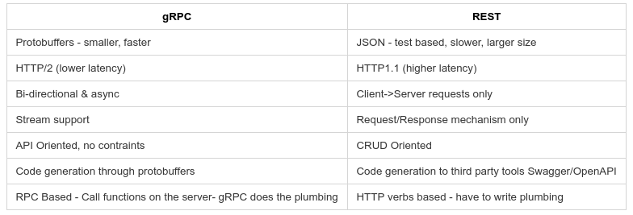
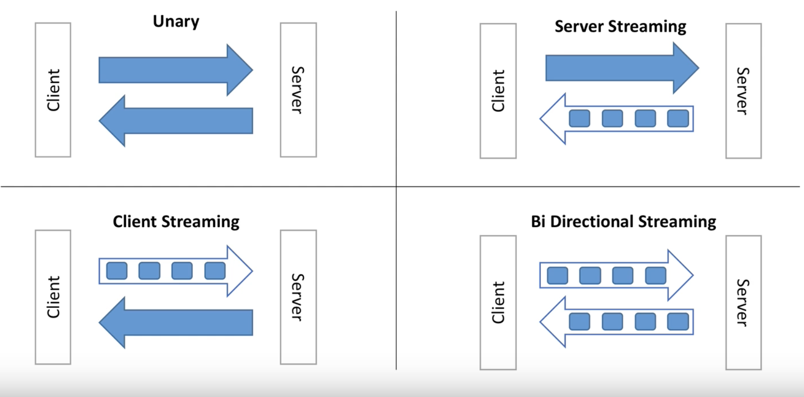

.center.icon[]

---


class: white
background-image: url(tmp/title.svg)
.top.icon[]

# gRPC

### Alexander Davydov


---

class: top white
background-image: url(tmp/sound.svg)
background-size: 130%
.top.icon[]

.sound-top[
  # Как меня слышно и видно?
]

.sound-bott om[
  ## > Напишите в чат
  ### **+** если все хорошо
  ### **–** если есть проблемы cо звуком или с видео
]

---

# Цель занятия 

.right-image[

]

# 
- Научиться писать обратно совместимые схемы в Protobuf
- Научиться писать gRPC сервисы 
- Получить представление о Clean Architecture

---

# План занятия

.big-list[
* Описание API с помощью Protobuf
* Генерация кода для GRPC клиента и сервера
* Реализация API
* Прямая и обратная совместимость API
* Представление о Clean Architecture
]

---

# Protocol buffers: типы данных 

скаляры:

- double (float64)
- float (float32)
- bool (bool)
- string (string) UTF-8 / 7-bit ASCII
- bytes ([]byte)
- int{32,64} (отрицательные значения - 10 байт)
- uint{32,64}
- sint{32,64} (ZigZag для отрицательных значений)

---

# Protocol buffers: wire types

class: black
background-image: url(img/tcp-udp-otlichiya-5.png)


---

# Protocol buffers: тэги

- 1 - 2^29 (536,870,911)
- 19000 - 19999 зарезервированы для  имплементации Protocol Buffers
- 1-15 занимают 1 байт, используем для часто используемых полей

- reserved tags (TODO)

---

# Protocol buffers: repeated fields

массив реализуется через repeated:

```
message SearchResponse {
  repeated Result results = 1;
}

message Result {
  string url = 1;
  string title = 2;
  repeated string snippets = 3;
}
```
```
...
Snippets             []string `protobuf:"bytes,3,rep,name=snippets,proto3" json:"snippets,omitempty"`
...
Results              []*Result `protobuf:"bytes,1,rep,name=results,proto3" json:"results,omitempty"`
```

---

# Protocol buffers: комментарии

```
/* Подробное описание
* результата поиска */
message Result {
  string url = 1;
  // название страницы
  string title = 2;
  repeated string snippets = 3; // фрагменты страницы
}
```

---

# Protocol buffers: дефолтные значения

- string: пустая строка
- number (int32/64 etc.): 0
- bytes: пустой массив
- enum: первое значение
- repeated: пустой массив


---

# Protocol buffers: Enums

```
enum EyeColor {
	UNKNOWN_EYE_COLOR = 0;
	EYE_GREEN = 1;
	EYE_BLUE = 2;
}
message Person {
	string name = 1;
	repeated string phone_numbers = 2;
	EyeColor eye_color = 3;
}
```

```
type EyeColor int32                                                             
                                                                                
const (                                                                         
    EyeColor_UNKNOWN_EYE_COLOR EyeColor = 0                                     
    EyeColor_EYE_GREEN         EyeColor = 1                                     
    EyeColor_EYE_BLUE          EyeColor = 2                                     
) 
```
---

# Protocol buffers: упражнение


---

# Protocol buffers: несколько сообщений в одном файле

```
message Person {
    string name = 1;
    Date birthday = 2;
}

message Date {
    int32 year = 1;
    int32 month = 2;
    int32 day = 3;
}
```


---

# Protocol buffers: вложенные сообщения

```
message Person {
    string name = 1;
    Date birthday = 2;

    message Address {
        string street = 1;
        string city = 2;
        string country = 3;
    }

    Address address = 3;
}
```

---

# Protocol buffers: импорты
<br><br>

date.proto:
```
message BirthDate {
    int32 year = 1;
    int32 month = 2;
    int32 day = 3;
}
```

person.proto:
```
import "date.proto";

message Person {
    string name = 1;
    BirthDate birthday = 2;

    message Address {
        string street = 1;
        string city = 2;
        string country = 3;
    }

    Address address = 3;
}
```

---

# Protocol buffers: пакеты

<br><br>
mydate.proto:
```
syntax = "proto3";

package my.date;

message Date {
    int32 year = 1;
    int32 month = 2;
    int32 day = 3;
}
```

person.proto:
```
syntax = "proto3";

import "date.proto";
import "mydate.proto";

message Person {
    string name = 1;
    BirthDate birthday = 2;
    my.date.Date last_seen = 4;
}
```


---

# Protocol buffers: упражнение

---

# Protocol buffers: protoc и генерация кода

```
protoc  --java_out=java --python_out=python *.proto
```

# TODO

---

# Protocol buffers: go_package

<br><br>
simplepb - более эксплицитно

```
syntax = "proto3";

package example.simple;

option go_package = "simplepb";

message SimpleMessage {
  int32 id = 1;
  bool is_simple = 2;
  string name = 3;
  repeated int32 sample_list = 4;
}
```
```
// Code generated by protoc-gen-go. DO NOT EDIT.
// source: simple/simple.proto

package simplepb

import proto "github.com/golang/protobuf/proto"
import fmt "fmt"
import math "math"
```


---

# Protocol buffers: запись на диск, JSON


---

class: black
background-size: 75%
background-image: url(img/backwardforward.png)


# Protocol buffers: прямая/обратная совместимость


---

# Protocol buffers: прямая/обратная совместимость

- не меняйте теги
- старый код будет игнорировать новые поля
- при неизвестных полях испольуются дефолтные значения (TODO!)
- поля можно удалять, но не переиспользовать тег / добавить префик OBSOLETE_ / сделать поле reserved
- правила изменения типов: https://developers.google.com/protocol-buffers/docs/proto#updating

---

# Protocol buffers: прямая/обратная совместимость

<b>Добавление полей</b>:

```
message MyMessage {
	int32 id = 1;
	+ добавим string fist_name = 2;
}
```

- старый код будет игнорировать новое поле
- новый код будет использовать значение по умолчанию при чтении "старых" данных
<br><br>

<b>Переименоваение полей</b>:

```
message MyMessage {
	int32 id = 1;
	- fist_name = 2;
	+ person_first_name = 2;
}
```

- бинарное представление не меняется, тк имеет значение только тег


---

# Protocol buffers: прямая/обратная совместимость

<b>reserved:</b><br><br>

```
message Foo {
    reserved 2, 15, 9 to 11;
	reserved "foo", "bar";
}
```

- можно резервировать теги и поля
- смешивать нельзя
- резервируем теги чтобы новые поля их не переиспользовали (runtime errors)
- резервируем имена полей, чтобы избежать багов

<b>никогда не удаляйте зарезервированные теги</b>
---

# Protocol buffers: дефолтные значения

<br>
- не можем отличить отсутствующее поле от пустого
- убедитесь, что с тз бизнес логики дефолтные значения бессмысленны

```
func (m *Course) GetTitle() string {
	if m != nil {
		return m.Title
	}
	return ""
}
```

<br>
enum'ы тоже можно добавлять, удалять и резервировать:

```
enum DayOfWeek {
    DAY_OF_WEEK_UNCPECIFIED = 0;
    MONDAY = 1;
    TUESDAY = 2;
    WEDNESDAY = 3;
    ...
}
```

---

# Protocol buffers: oneof, map

oneof - только одно поле из списка может иметь значение
и не может быть repeated

```
message Message {
    int32 id = 1;
    oneof auth {
        string mobile = 2;
        string email = 3;
        int32 userid = 4;
    }
}
```

map: - асс. массив, ключи - скаляры (кроме float/double) значения - любые типы, не может быть repeated

```
message Result {
    string result = 1;
}

message SearchResponse {
    map<string, Result> results = 1;
}
```

---

# Protocol buffers: Well Known Types

https://developers.google.com/protocol-buffers/docs/reference/google.protobuf

```
syntax = "proto3";

import "google/protobuf/timestamp.proto";
import "google/protobuf/duration.proto";


message MyMessage {
    google.protobuf.Timestamp last_online = 1;
    google.protobuf.Duration session_length = 2;
}
```


---

# Protocol buffers: style guide
<br>

https://developers.google.com/protocol-buffers/docs/style
<br><br>
- строка 80, отступ 2
- файлы lower_snake_case.proto
- сообщения CamelCase, поля - underscore_separated_names 
- CAPITALS_WITH_UNDERSCORES для enums

<br><br>
```
message SongServerRequest {
  required string song_name = 1;
}

enum Foo {
  FOO_UNSPECIFIED = 0;
  FOO_FIRST_VALUE = 1;
  FOO_SECOND_VALUE = 2;
}
```

# 

---

# HTTP/2 vs HTTP

https://imagekit.io/demo/http2-vs-http1
https://developers.google.com/web/fundamentals/performance/http2/

---

background-image: url(img/http2inoneslide.png)
# HTTP/2


---


# HTTP/2
   
- бинарный вместо текстового
- мультиплексирование — передача нескольких асинхронных HTTP-запросов по одному TCP-соединению
- сжатие заголовков методом HPACK
- Server Push — несколько ответов на один запрос
- приоритизация запросов
- безопасность

https://medium.com/@factoryhr/http-2-the-difference-between-http-1-1-benefits-and-how-to-use-it-38094fa0e95b

---

# RPC

- сетевые вызовы абстрагированы от кода
- интерфейсы как сигнатуры функций (Interface Definition Language для language-agnostic)
- тулзы для кодогенерации
- зачастую используют кастомные протоколы


---

# Что такое gRPC

https://github.com/grpc/grpc/blob/master/doc/g_stands_for.md

---

# gRPC vs REST

<!--class: black
background-image: url(img/grpcvsrest.png)
-->
.image[

]


---

class: black
background-size: 75%
background-image: url(img/grpcapitypes.png)


# Типы gRPC API


<!--.image[

]-->

class: top white
background-image: url(tmp/sound.svg)
background-size: 130%
.top.icon[]


---

# Scalability

---

# gRPC: Errors

https://grpc.io/docs/guides/error/
https://godoc.org/google.golang.org/grpc/codes
https://godoc.org/google.golang.org/grpc/status
https://jbrandhorst.com/post/grpc-errors/
http://avi.im/grpc-errors/

```
func (*server) SquareRoot(ctx context.Context, req *calculatorpb.SquareRootRequest) (*calculatorpb.SquareRootResponse, error) {
	fmt.Println("Received SquareRoot RPC")
	number := req.GetNumber()
	if number < 0 {
		return nil, status.Errorf(
			codes.InvalidArgument,
			fmt.Sprintf("Received a negative number: %v", number),
		)
	}
	return &calculatorpb.SquareRootResponse{
		NumberRoot: math.Sqrt(float64(number)),
	}, nil
}
```

---

# gRPC: Errors

```
	res, err := c.SquareRoot(context.Background(), &calculatorpb.SquareRootRequest{Number: n})
	if err != nil {
		respErr, ok := status.FromError(err)
		if ok {
			// actual error from gRPC (user error)
			fmt.Printf("Error message from server: %v\n", respErr.Message())
			fmt.Println(respErr.Code())
			if respErr.Code() == codes.InvalidArgument {
				fmt.Println("We probably sent a negative number!")
				return
			}
		} else {
			log.Fatalf("Big Error calling SquareRoot: %v", err)
			return
		}
	}
```


---

# gRPC: Deadlines

---

# gRPC: Reflection + Evans CLI


```
import "google.golang.org/grpc/reflection"

s := grpc.NewServer()
pb.RegisterYourOwnServer(s, &server{})

// Register reflection service on gRPC server.
reflection.Register(s)

s.Serve(lis)
```

https://github.com/ktr0731/evans

---

# gRPC: Security (SSL/TLS)

https://bbengfort.github.io/programmer/2017/03/03/secure-grpc.html
https://medium.com/@gustavoh/building-microservices-in-go-and-python-using-grpc-and-tls-ssl-authentication-cfcee7c2b052

---

# Итого: почему gRPC

class: black
background-image: url(img/tcp-udp-otlichiya-5.png)


---

class: black
background-size: 75%
background-image: url(img/cleanarch.jpg)
# Clean Architecture

---

# Clean Architecture

<br><br>

https://blog.cleancoder.com/uncle-bob/2012/08/13/the-clean-architecture.html

<br><br><br>

- независимость от фреймворка
- тестируемость
- независимоcть от UI
- независимоcть от базы данных
- независимость от какого-либо внешнего сервиса

<b>Правило Зависимостей. Зависимости в исходном коде могут указывать только во внутрь. Ничто из внутреннего круга не может знать что-либо о внешнем круге, ничто из внутреннего круга не может указывать на внешний круг.

---

# Clean Architecture

- Entities (models, модели)
- Use Cases (controllers, сценарии)
- Interface Adapters ()
- Frameworks and Drivers (инфраструктура)

---

background-image: url(https://raw.githubusercontent.com/bxcodec/go-clean-arch/master/clean-arch.png)
# Clean Architecture

---

# Clean Architecture


https://github.com/bxcodec/go-clean-arch

---

-
# Тест

https://forms.gle/SiDmYTPUU5La3rA88

---


# На занятии

- Изучили что такое контекст
- Изучили особенности протоколов TCP и UDP
- Изучили стандартные типы Conn и Dialer
- Узнали о типичных сетевых проблемах
- Научились обеспечивать тайм-ауты
- Научились отлаживать сетевые проблемы

---

## Вопросы?

---

# Опрос

Не заполните заполнить опрос. Ссылка на опрос будет в слаке.

---

class: white
background-image: url(tmp/title.svg)
.top.icon[]

# Спасибо за внимание!
