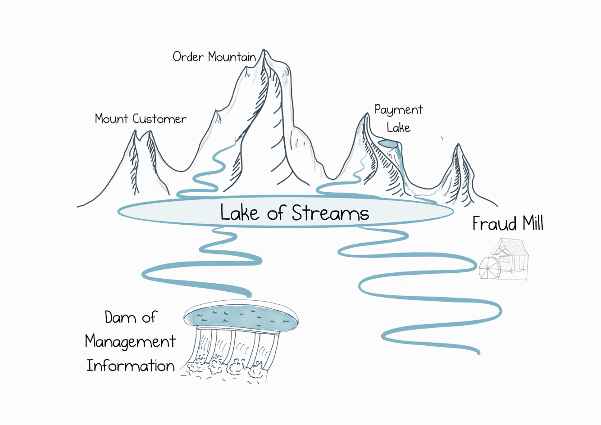
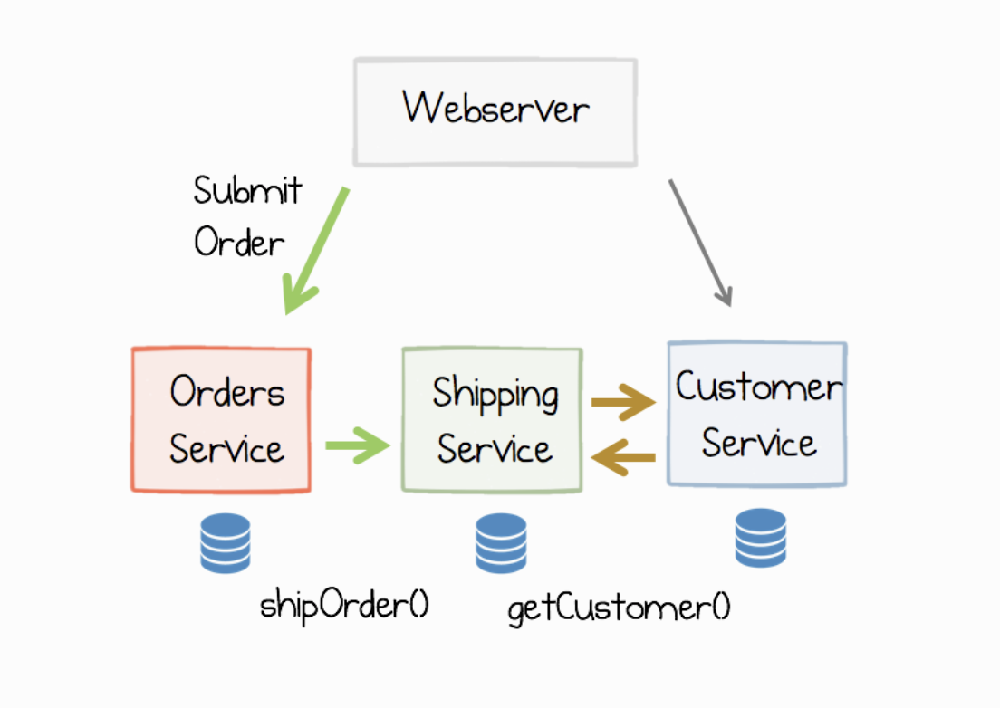
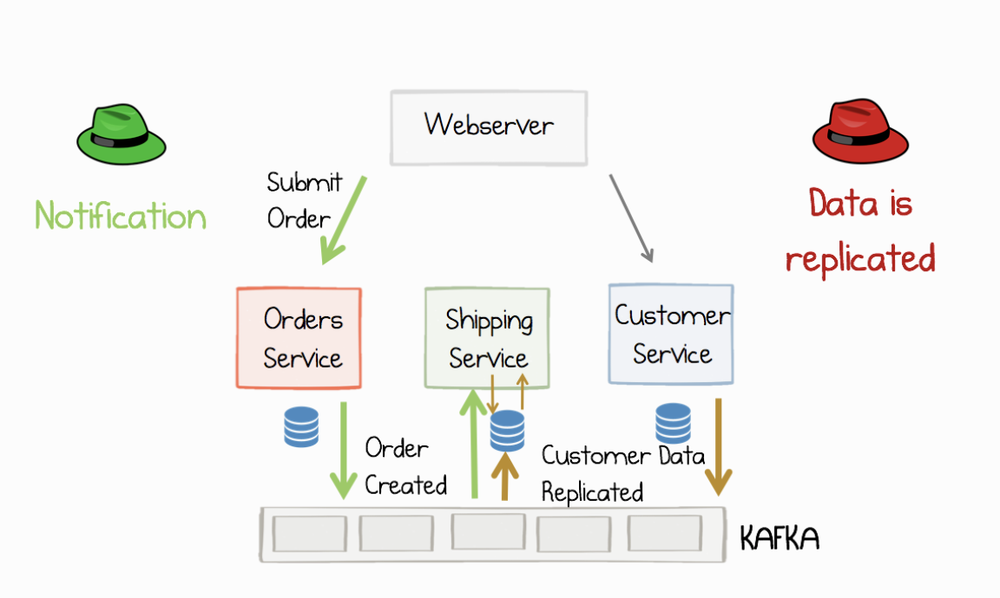
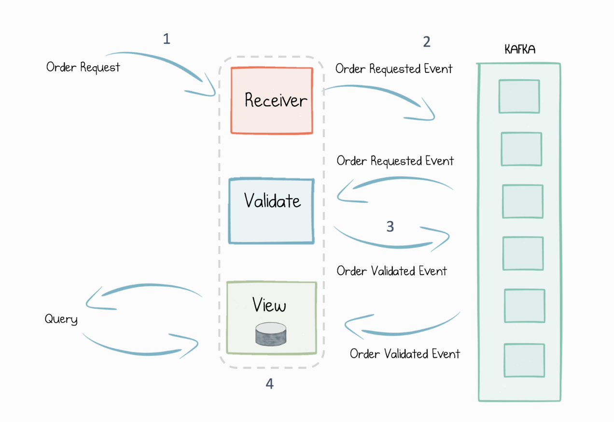
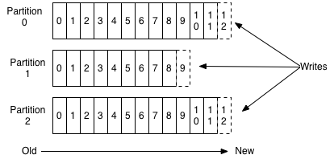
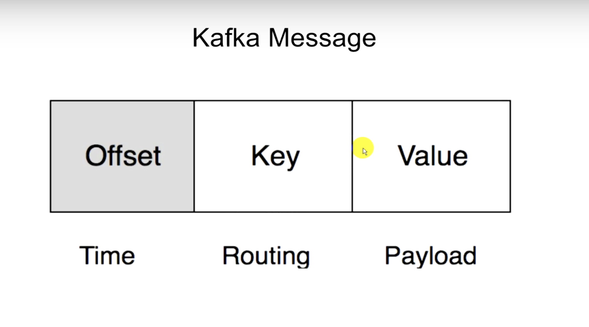
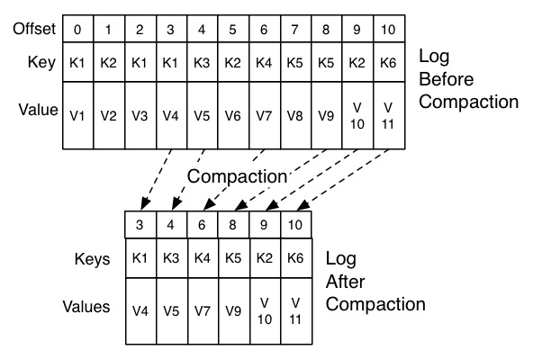

.center.icon[]

---

class: top white
background-image: url(img/sound.svg)
background-size: 130%
.top.icon[]

.sound-top[
  # Как меня слышно и видно?
]

.sound-bottom[
  ## > Напишите в чат
  ### **+** если все хорошо
  ### **-** если есть проблемы cо звуком или с видео
  ### !проверить запись!
]

---

class: white
background-image: url(img/message.svg)
.top.icon[]

# Очереди сообщений

### Александр Давыдов

---

# План занятия

.big-list[
* Событийно-ориентированная архитектура
* Apache Kafka
* RabbitMQ
* Использование RabbitMQ, Kafka: где что применять
]

---

# Вернемся к микросервисам...

.main-image[
 
]

---

# Событийно-ориентированная архитектура

.main-image[
 
]

---

# Паттерны: Event Notification

.main-image[
 
]

request-driven

---

# Паттерны: Event Notification

.main-image[
 
]

---

# Паттерны: State Transfer

.main-image[
 
]

---

# Паттерны: Event Sourcing

.main-image[
 
]

---

# Паттерны: Command Query Responsibility Segregation

.main-image[
 
]

---
class: black
background-size: 65%
background-image: url(img/herokukafka.png)
# Что такое Kafka

---

class: black
background-size: 65%
background-image: url(img/kafka-apis.png)
# Kafka: core APIs
---

# Kafka: core APIs

- The Producer API allows an application to publish a stream of records to one or more Kafka topics.
- The Consumer API allows an application to subscribe to one or more topics and process the stream of records produced to them.
- The Streams API allows an application to act as a stream processor, consuming an input stream from one or more topics and producing an output stream to one or more output topics, effectively transforming the input streams to output streams.
- The Connector API allows building and running reusable producers or consumers that connect Kafka topics to existing applications or data systems. For example, a connector to a relational database might capture every change to a table.

---

# Kafka: как устроен топик

.main-image[
 
]

---

# Kafka: как устроен топик

.main-image[
 
]

---

# Kafka: consumers

.main-image[
 
]

---

# Kafka: сообщение

.main-image[
 
]

---

# Kafka: сжатие лога

.main-image[
 
]

---

# Kafka: гарантии

- Messages sent by a producer to a particular topic partition will be appended in the order they are sent. That is, if a record M1 is sent by the same producer as a record M2, and M1 is sent first, then M1 will have a lower offset than M2 and appear earlier in the log.
- A consumer instance sees records in the order they are stored in the log.
- For a topic with replication factor N, we will tolerate up to N-1 server failures without losing any records committed to the log.
- More details on these guarantees are given in the design section of the documentation.

---

# Kafka: юзкейсы

- message broker (ActiveMQ / RabbitMQ)
- трекинг активности в вебе (linkedin)
- метрики
- агрегация логов
- stream processing (Kafka Streams)
- event sourcing (https://martinfowler.com/eaaDev/EventSourcing.html)

- storage? https://www.confluent.io/blog/okay-store-data-apache-kafka/

---

# Kafka + Go: драйверы

https://github.com/segmentio/kafka-go
https://github.com/confluentinc/confluent-kafka-go
https://github.com/Shopify/sarama

---

# Kafka vs RabbitMQ

# https://content.pivotal.io/blog/understanding-when-to-use-rabbitmq-or-apache-kafka

---

# Ссылки

.big-list[
* [https://content.pivotal.io/blog/understanding-when-to-use-rabbitmq-or-apache-kafka](https://content.pivotal.io/blog/understanding-when-to-use-rabbitmq-or-apache-kafka)
* [https://golang.org/pkg/database/sql](https://golang.org/pkg/database/sql)
* [https://jmoiron.github.io/sqlx](https://jmoiron.github.io/sqlx)
]
---

# Опрос

.left-text[
Заполните пожалуйста опрос
  
[https://otus.ru/polls/4749/](https://otus.ru/polls/4749/)
]

.right-image[

]

---

class: white
background-image: url(img/message.svg)
.top.icon[]

# Спасибо за внимание!
